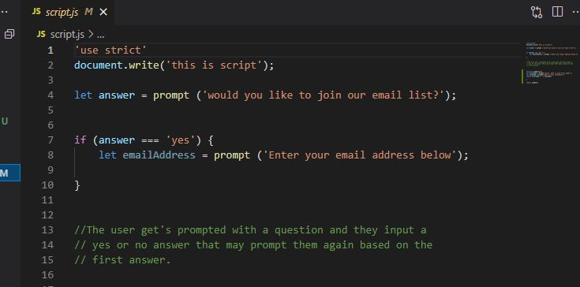

# ***Learning About JavaScript***

## *JavaScript Makes The Webpage come ALIVE*

- JavaScript, which is often shortened to just JS, is a scripting language
that integrates and performs complicated actions on a webpage. It can do 
implement features such as pop-up text boxes, animations, sliding bodies
of text and so on. It really is one code language that allows the webpage to lift off the screen and integrate user input.

- The user input feature is very exciting to me in that it means there's now
an opportunity for me to create forms with code. Creating custom forms is one of the reasons I'm learning code, and JS has opened my mind to the possibilities! 

### *Check Out Some JavaScript I've Written:*

<li> </li>
