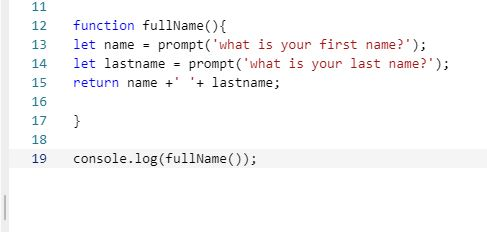

# ***ABOUT FUNCTIONS***

## Nutshell

- Functions are small or large bits or blocks of code that make something happen.
They are invoked or called and when called run the line of code. That is until
it reaches the return statement. Then it stops. 

- Functions come in handy in so many ways, and they can simplify the coding 
process for instance when things get lengthy. Functions are really just lines
of codes that can be used over and over. Take for instance a webpage with a
checkout form. There's a lot of information that the user needs to input on such
forms and when used correctly functions can be called throughout the code
to make specified events take place. The "if this then that" scenario where
for instance if the user forgets to fill a certain box like their zip code 
or something, a function can be coded in that would present a reminder user
side that would say "please enter zip code to continue." or the one we all
see like "All fields must be filled to proceed." 

- Functions really are just a useful tool to have in the developer tool bag. I
look forward to applying them more in my code in the days ahead. 

### Check out my first function here:

<li> </li>

