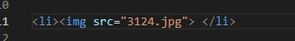

# ***Some Information I've Learned About HTML***

## HTML stand for Hyper Text Markup Language and is the gold standard for webpages:

### 1. The HTML Element

An HTML element is content surround by a start tag and end tag. See below:

<li> </li>

### 2. It describes how a page is structured and presented

When a webpage loads there is a lot information that needs to be displayed.
HTML breaks everyhting down into sections such as:

<'body'>
<'title'>
and
<'footer'>`

 
 ### 3. Links and pictures can be linked into html

 <li> </li>

 There's so much HTML around us on the internet, it's amazing to see what people have
 created with it. I'm enjoying learning more and look forward to applying more in the days 
 ahead. 